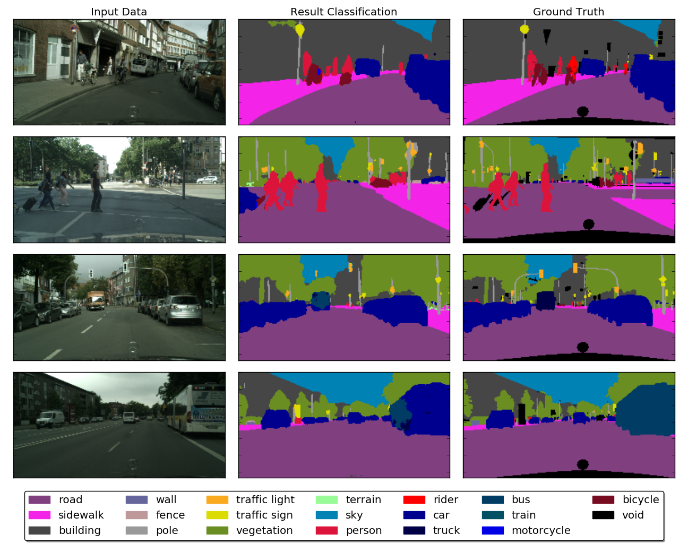
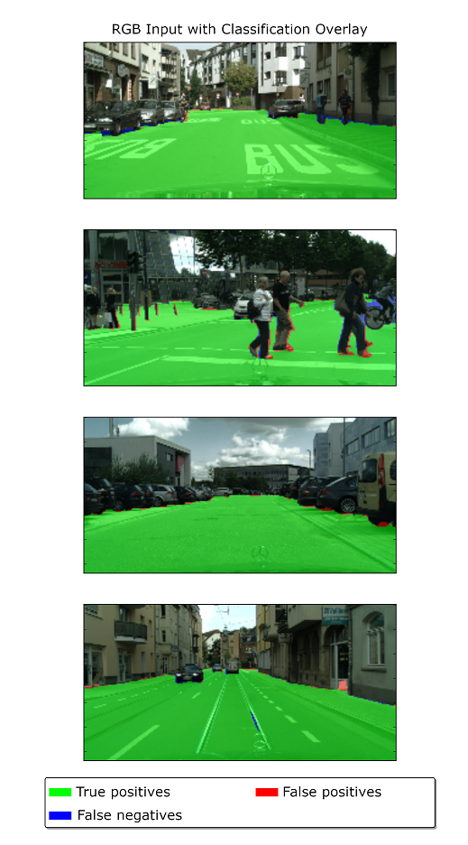
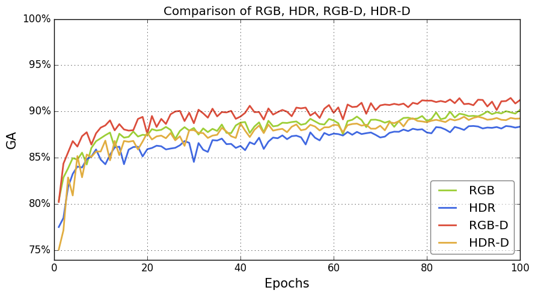

# Deep Learning Experiments
Collection of various deep learning experiments with details and demos of results. (Work in progress.)

1. [Training Objectives](#training-objectives)

    1.1 [Identity Autoencoder](#identity-autoencoder)

    1.2 [Denoiser](#denoiser)

    1.3 [Super-Resolution](#super-resolution)

    1.4 [Pixel-Based Classification](#pixel-based-classification)

2. [Datasets](#datasets)

    2.1 [MNIST](#mnist)

    2.2 [Fashion MNIST](#fashion-mnist)

    2.3 [CIFAR-10 and CIFAR-100](#cifar-10-and-cifar-100)

    2.4 [Cityscapes](#cityscapes)

    

# Training Objectivess
## Identity Autoencoder
Convolutional autoencoder. It could be useful to evaluate the precision of feature representations and find the right spot between undercomplete and overcomplete representations to avoid overtraining and underperformance for the given data domain.

### Details
* *Training details*:
  * *Training objective*: Reproduction of input after encoding it into a feature map.
  * *Architecture*: Shallow UNet (depth 2) with additional vertical residual connections.
  * *Loss function*: Mean squared error.
  * *Optimizer*: Adam.
* *Data*:
  * *Input*: Grayscale/color images.
  * *Ground truth*: Same as input.

### Results

#### MNIST Dataset

#### Fashion MNIST Dataset

#### CIFAR-10 Dataset

#### CIFAR-100 Dataset

## Denoiser
Convolutional autoencoder. It removes noise from the input image. This can be useful e.g. for photos taken in the dark.

### Details
* *Training details*:
  * *Training objective*: Reproduction of input after encoding it into a feature map.
  * *Architecture*: Shallow UNet (depth 2) with additional vertical residual connections.
  * *Loss function*: Mean squared error.
  * *Optimizer*: Adam.
* *Data*:
  * *Input*: Grayscale/color images.
    * *Augmentation*: Strong noise (preprocessed once before the training).
  * *Ground truth*: Unaugmented input.

### Results

#### MNIST Dataset

#### Fashion MNIST Dataset

#### CIFAR-10 Dataset

#### CIFAR-100 Dataset

## Super-Resolution
Convolutional autoencoder. It quadruples the resolution of the input image. This can be useful e.g. for supersampling, but also for more efficient rendering at a lower original resolution.

### Details
* *Training details*:
  * *Training objective*: Upscale the input image to the quadruple resolution (double width and height).
  * *Architecture*: Very shallow UNet (depth just 1) with additional vertical residual connections and additional upconvolution block.
  * *Loss function*: Mean squared error.
  * *Optimizer*: Adam.
* *Data*:
  * *Input*: Grayscale/color image downscaled by factor 2.
  * *Ground truth*: Original resolution of input image.

### Results

#### MNIST Dataset

#### Fashion MNIST Dataset

#### CIFAR-10 Dataset

#### CIFAR-100 Dataset

## Pixel-Based Classification

Recap of my Master's thesis results from August 2017, where I trained a *[Fully Convolutional DenseNet](https://arxiv.org/abs/1611.09326)* for pixel-based classification with the Cityscapes dataset.

### Details

- *Training details*:
  - *Training objective*: Pixel-based classification for a wide array of classes as well as just walkable areas.
  - *Architecture*: *[Fully Convolutional DenseNet](https://arxiv.org/abs/1611.09326)*.
  - *Loss function*: Crossentropy, but ignores regions masked with void labels.
  - *Tracked metric*: *mean intersection over union* (mIoU) for early stopping and plateau breaking.
  - *Optimizer*: Adam.
- *Data*:
  - *Input*: Color image concatenated with precomputed disparity image, downscaled by a factor of 8: (256, 128).
    - *Augmentation*: Random horizontal flipping.
    - *Training scope*: All finely annotated (left camera) images with corresponding disparity (~5000 images).
    - *Validation splitting* (training, validation, test): 2472/500/503.
  - *Ground truth*:
    - For the broad classification experiment: Used all finely annotated
      - *Note*: *"Broad"* in this context means all available classes
    - For the walkable-only experiment: As for full spectrum, but summarized all walkable classes vs all others
    - For the data type experiments: Also used HDR versions of the dataset
    - For the depth experiments: Also used precomputed disparities of the Cityscapes dataset
    - *Note*: Ground truth (GT) was downscaled as well by a factor of 8 to match the input resolution.
      - Provided metrics in further experiments are valid for the comparison of prediction vs downscaled GT.
      - With an upscaling of the given prediction via super-resolution to the original GT size, a comparison with the original resolution would probably result in similar accuracy scores.

### Evaluation Video for Full Spectrum Classes and Walkable Areas

Video for evaluation results after training for 100 epochs. Trained on RGB-D (concatenated layers). From my Master's thesis, which was finished in August 2017:

(*Click image for redirection to YouTube. See video description for further details.*)

### Evaluation Example for Broad Classification

A global accuracy of 92.2% was achieved with a training for the classification of the whole available class spectrum (see legend of the plot below).

*Note*: Training was done with RGB-D.

### Evaluation Example for Walkable Areas

A global accuracy of 96.8% was achieved with a training for the classification of walkable areas. Unfortunately, edge regions are blurry and the main weakness of this classifier. Probably the results could be further improved with upscaled losses in edge regions or adding the *EdgeNet* part from the *[S-Shape Network](http://dro.dur.ac.uk/25156/)* to the architecture.

*Note*: Training was done with RGB-D.

### Evaluation for Input Data Types

Evaluated RGB (8 Bit per value) vs HDR (16 Bit per value), with and without additional precomputed disparity images for depth. Perhaps HDR performed slightly worse than RGB because of a vastly increased data entropy and a too small training dataset (regarding both, amount of images and used downscaled resolution). In contrast, additional depth always provided an advantage.

*Figure: Development of global accuracy (GA) for evaluation dataset over the course of 100 training epochs.*

# Datasets

This chapter is meant to provide a short introduction to different interesting datasets I used in my experiments.

Regarding the licenses for my predicted images, they are of course licensed accordingly with the same license as the input data. Regarding my own images, they are unlicensed and free for any use, similar to [the Unlicense](http://unlicense.org/) philosophy. Though, I appreciate staring or mentioning this repository.

<!-- add valid license for media similar to the Unlicense -->

## MNIST

### Introduction

MNIST is the "*Hello World*" of deep learning. The perfect data to start experiments with your first neural networks.  It's providing a total of 70'000 images. Since it's the image shape is very small with just (28, 28, 1), you can have the fastest (Computer Vision oriented) convolutional neural network training possible. Given a decent GPU, you can finish training experiments within minutes. It's a nice dataset to gather some experience with basic architecture elements and different architecture approaches. You can find more info on [the official website](http://yann.lecun.com/exdb/mnist/). According to [this source](http://www.pymvpa.org/datadb/mnist.html), it's licensed with *Creative Commons Attribution-ShareAlike 3.0*. It's easily accessible within/through Keras and commonly used for deep learning introductions.

### Complexity

Though, since the complexity of the data is fairly low, not everything that works here will work for more complex problems. Even a classification autoencoder could achieve here pretty good results, since the dataset consists of mostly black and white. Only little motivation to learn the other *254 shades of gray* for the neural network.

### Training Time

With a *GTX 1070* it took roughly 4–5min for 25 epochs. Though, improvements for such simple tasks actually slowed down already after a few epochs.

<!-- TODO: Add a few example images -->

## Fashion MNIST

### Introduction

Since MNIST is too simple, fashion MNIST is the next level of complexity. It is similar to the MNIST dataset. The only difference is, that instead of digits, you have 10 different types of clothing. The dataset is provided by [Zalando's research group](https://github.com/zalandoresearch/fashion-mnist). The dataset is licensed with the *MIT license*. It's also easily accessible within/through Keras and commonly used for deep learning introductions.

<!-- TODO: Add a few example images -->

### Complexity

While for MNIST, a neural network could achieve extraordinary results with just classifying every pixel either black or white, this dataset offers new challenges: Meaningful grayscale values and patterns.

### Training Time

Similar to the previous dataset, with a *GTX 1070* it took roughly 5–6min for 25 epochs. Though, improvements for such simple tasks actually slowed down already after a few epochs.

## CIFAR-10 and CIFAR-100

### Introduction

In contrast to the previous two datasets, which were grayscale, CIFAR-10/100 datasets is RGB and has a slightly higher resolution with a shape of (32, 32, 3). Since the resolution is (2n, 2n, x), it's also easier to work with convolutions, since you have to take less care with paddings for deeper architectures (in contrast to the previous datasets). CIFAR-100/100 consist of very low resolution photographs. The CIFAR-10 datasets consists of 10 classes while the CIFAR-100 dataset consists of 100 classes accordingly. Take a look at [the official website](http://yann.lecun.com/exdb/mnist/) for more info.  The licensing seems unspecified, but the images could be subject to copyright. It's also easily accessible within/through Keras and commonly used for deep learning introductions. 

<!-- TODO: Add a few example images -->

### Complexity

Real world photographs and thus a vast variability, colors (thus 3 input layers instead of just 1) and the slightly higher resolution make these datasets much more complex compared to the previous two.

### Training Time

As with all mentioned very low resolution datasets, with a *GTX 1070* it took roughly 5–6min for 25 epochs. Though, improvements for such simple tasks actually slowed down already after a few epochs.

## Cityscapes

### Introduction

The Cityscapes is an oasis for more complex deep learning experiments. This dataset provides a huge array of different data and is especially suited for gathering experience with autonomous driving problems. Here's a list of the available data:

* **Binocular photographs**
  * From the perspective of the car hood
  * Total of 25'000 binocular image pairs
  * Taken in...:
    * 50 different large German cities
    * different weather conditions and seasons
  * Available in either 8 Bit or 16 Bit (HDR).
* **Precomputed depth**
  * Disparity maps, computed with stereo matching from the binocular images
  * 25'000 images as well, one for every binocular image pair
* **Annotations** (labels)
  * 30 classes
  * 5'000 annotation images precisely annotated
  * 20'000 annotation images coarsely annotated
* [**Some scripts/tools**](https://github.com/mcordts/cityscapesScripts)
  * Among others: An [annotation tool](https://github.com/mcordts/cityscapesScripts/blob/master/cityscapesscripts/annotation/cityscapesLabelTool.py), with which you could create annotations e.g. for own data

The dataset is provided by Daimler AG, MPI Informatics and TU Darmstadt. You can request access on the [Cityscapes website](https://www.cityscapes-dataset.com/). The dataset has a [custom license](https://www.cityscapes-dataset.com/license/), but – in short – it's free for non-commercial purposes.

<!-- TODO: Add a few example images -->

### Complexity

The images have a high resolution and thus give you the possibility to experiment with very deep, state-of-the-art convolutional neural network architectures. It also provides data to experiment with multimodal input (e.g. additional depth data vs. just RGB), segmentation, class hierarchies and more in real world conditions. This is the level of complexity scientific papers are written and state-of-the-art neural networks trained with. Highly recommended dataset.

<!-- (TODO: specify exact resolution) -->

### Training Time

For my experiments with the *Fully Convolutional Densenets* and a *GTX 1070*, it took roughly 8–12h until results stagnated for 1/8 resolution input images. Though, back then I worked with *Theano* and *Lasagne*, so not sure about the training time with today's *Keras* with *Tensorflow* backend. Perhaps it's in a similar range.