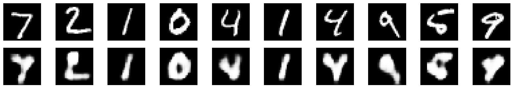
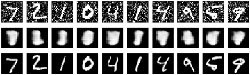
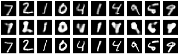

# Deep Learning Portfolio
Collection of various deep learning experiments with details and demos of results.

1. [Autoencoders](#autoencoders)

    1.1 [Identity Autoencoder](#identity-autoencoder)

    1.2 [Denoiser Autoencoder](#denoiser-autoencoder)

    1.3 [Super-Resolution Autoencoder](#super-resolution-autoencoder)

# Autoencoders
## Identity Autoencoder
Convolutional identity autoencoder.

### Details
* *Training details*:
  * *Training objective*: Reproduction of input after encoding it into a feature map.
  * *Loss function*: Mean squared error.
  * *Optimizer*: Adam.
* *I/O*:
  * *Input*: (28, 28, 1) grayscale images of digits (MNIST dataset).
  * *Ground truth*: Same as input.

### Results
* *Content*: Validation results over the course of 20 training epochs.
* *Layout*:
  * *Top row*: Input (= ground truth).
  * *Bottom row*: Prediction of the identity autoencoder.

## Denoiser Autoencoder
Convolutional denoiser autoencoder.

### Details
* *Training details*:
  * *Training objective*: Reproduction of input after encoding it into a feature map.
  * *Loss function*: Mean squared error.
  * *Optimizer*: Adam.
* *I/O*:
  * *Input*: (28, 28, 1) grayscale images of digits (MNIST dataset).
    * *Augmentation*: With noise (preprocessed once before the training).
  * *Ground truth*: Unaugmented input.

### Results
* *Content*: Validation results over the course of 20 training epochs.
* *Layout*:
  * *Top row*: Input.
  * *Mid row*: Prediction of the denoiser autoencoder.
  * *Top row*: Ground truth.

## Super-Resolution Autoencoder
Convolutional super-resolution autoencoder which quadruples the resolution of the input image.

### Details
* *Training details*:
  * *Training objective*: Upscale the input image to the quadruple resolution (double width and height).
  * *Loss function*: Mean squared error.
  * *Optimizer*: Adam.
* *I/O*:
  * *Input*: (14, 14, 1) grayscale images of digits (MNIST dataset), downscaled from original size (28, 28, 1).
    * *Augmentation*: Noise (preprocessed once before the training).
  * *Ground truth*: (28, 28, 1) original resolution of input image.

### Results
* *Content*: Validation results over the course of 20 training epochs.
* *Layout*:
  * *Top row*: Input.
  * *Mid row*: Prediction of the denoiser autoencoder.
  * *Top row*: Ground truth.

